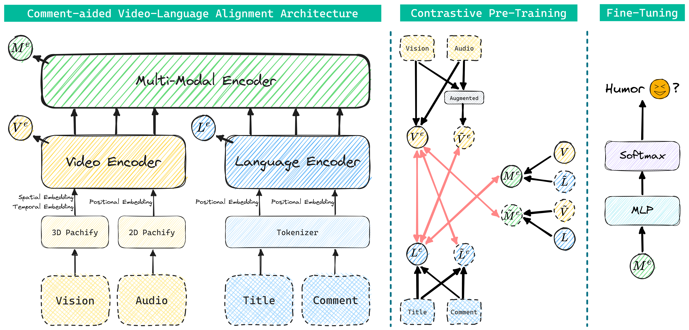

# 🎬 Comment-aided Video-Language Alignment via Contrastive Pre-training for Short-from Video Humor Detection

[Comment-aided Video-Language Alignment via Contrastive Pre-training for Short-from Video Humor Detection](https://arxiv.org/abs/2402.09055)

[Yang Liu](https://yliu-cs.github.io), Tongfei Shen, Dong Zhang, Qingying Sun, Shoushan Li and Guodong Zhou

<p>
  
</p>

The growing importance of multi-modal humor detection within affective computing correlates with the expanding influence of short-form video sharing on social media platforms. In this paper, we propose a novel two-branch hierarchical model for short-form video humor detection (SVHD), named Comment-aided Video-Language Alignment (CVLA) via data-augmented multi-modal contrastive pre-training. Notably, our CVLA not only operates on raw signals across various modal channels but also yields an appropriate multi-modal representation by aligning the video and language components within a consistent semantic space. The experimental results on two humor detection datasets, including DY11k and UR-FUNNY, demonstrate that CVLA dramatically outperforms state-of-the-art and several competitive baseline approaches. Our dataset, code and model are available here.

## 🏠 Preparations

Clone this reposity:

```shell
git clone https://github.com/yliu-cs/CVLA.git
cd CVLA
```

The directory tree is shown as below:

```
CVLA
├── dataset
│   ├── labeled
│   │   ├── 6557952865950764295
│   │   │   ├── video.mp4
│   │   │   ├── comment.json
│   │   │   ├── info.json
│   │   │   └── audio.wav
│   │   └── ...
│   ├── unlabeled
│   │   ├── 6937837057259621664
│   │   │   └── ...
│   │   └── ...
│   ├── split
│   │   └── train
│   └── vid2en.pkl
├── plot
│   ├── attention.py
│   ├── duration.py
│   ├── like.py
│   ├── loss.py
│   ├── Theme.md
│   └── ...
├── tools
│   ├── gather_result.py
│   ├── split_dataset.py
│   └── translate.py
├── run.sh
├── run.py
├── param.py
├── models.py
├── data.py
├── README.md
└── requirements.txt
```

Download our proposed dataset DY11K from [DY11K Download URL](), and unzip it into dataset folder.

## ⚙️ Requirements

To run our code, please install all the dependency packages by using the following command:

```shell
conda create -n CVLA python=3.10
conda activate CVLA
pip install torch==1.13.1+cu116 torchvision==0.14.1+cu116 torchaudio==0.13.1 --extra-index-url https://download.pytorch.org/whl/cu116
pip install -r requirements.txt
```

**Note**: Different versions of packages (like `pytorch`, `transformers`, etc.) may lead to different results from the paper. However, the trend should still hold no matter what versions of packages you use.

## 🎮 Multiple data splits

To carry out experiments with multiple data splits (aggregate the results over 5 different seeds), you can use the following scripts:

```shell
for seed in 2 42 327 2023 998244353
do
	python tools/split_dataset.py --seed $seed
done
```

## 🚀 Experiments with multiple runs

Multiple model training give a more robust measure of performance and a better estimate of the standard, you can use the following scripts:

```shell
for seed in 2 42 327 2023 998244353
do
	python run.py --seed=$seed
done
```

Then run the following command to gather all the results:

```shell
python tools/gather_result.py > gathered_result.log
```

## 📧 Bugs or questions?

If you have any questions related to the code or the paper, feel free to email Yang (`yliu.cs.cn@gmail.com`). If you encounter any problems when using the code, or want to report a bug, you can open an issue. Please try to specify the problem with details so we can help you better and quicker!

## ❤️ Acknowledgment

Thanks [Clover](https://github.com/LeeYN-43/Clover), [TVLT](https://github.com/zinengtang/TVLT), [nanoGPT](https://github.com/karpathy/nanoGPT) and [thop](https://github.com/Lyken17/pytorch-OpCounter) for their excellent code implementations, which aided later study and are referenced in this implementation as available source code.

## 📜 Citation

Please cite our paper if you use CVLA in your work:

```bibtex
@misc{liu2024commentaided,
      title={Comment-aided Video-Language Alignment via Contrastive Pre-training for Short-form Video Humor Detection}, 
      author={Yang Liu and Tongfei Shen and Dong Zhang and Qingying Sun and Shoushan Li and Guodong Zhou},
      year={2024},
      eprint={2402.09055},
      archivePrefix={arXiv},
      primaryClass={cs.CV}
}
```